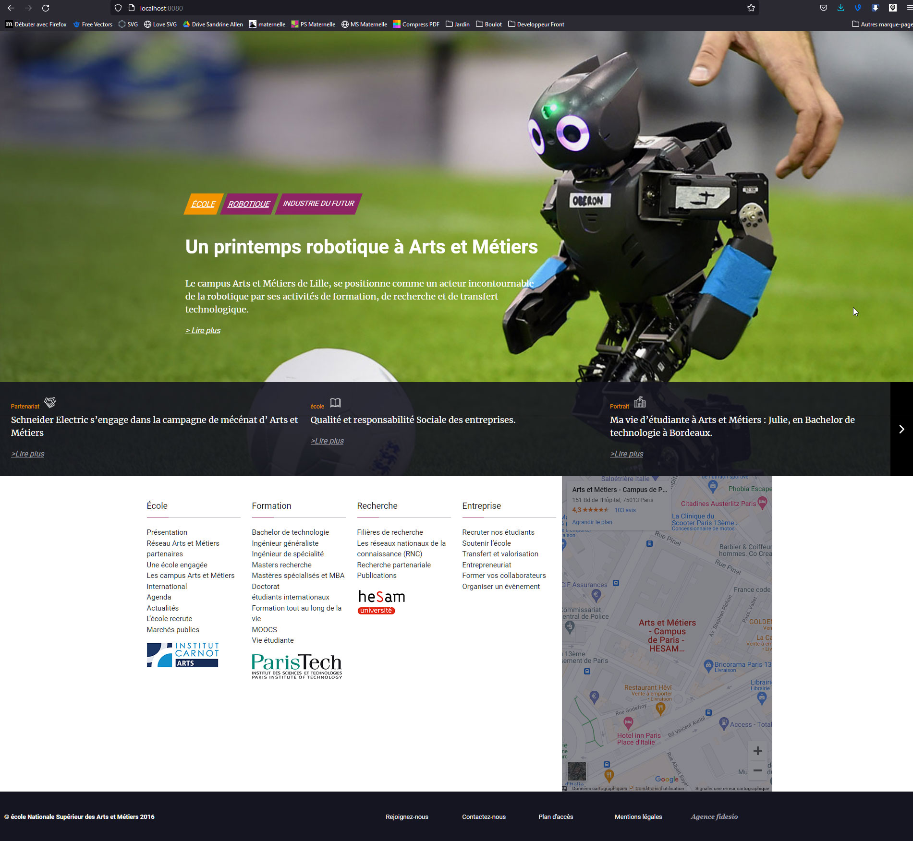

# cecile-bordes-fidesio

## Project setup
```
npm install
```

```javascript
$ npm install -g @vue/cli
$ vue create cecile-bordes-fidesio
$ cd cecile-bordes-fidesio
$ npm install popper.js jquery
$ npm install --save-dev sass sass-loader@10
$ npm install bootstrap@4.5.3
$ npm install vue bootstrap-vue
$ npm install -g sass
$ npm i sass-loader@10
$ npm i vue-horizontal-list
$ npm install vue-animate-onscroll
$ npm install aos --save
$ cd src/assets/sass
$ sass  --watch app.scss:app.css --style compressed
```
### Compiles
```
npm run serve
```

### Compiles and minifies for production
```
npm run build
```

### Rendu


[](https://Cecile-Bordes.github.io/cecile-bordes-fidesio/Rendu/)
[]


### Customize configuration
See [Configuration Reference](https://cli.vuejs.org/config/).
